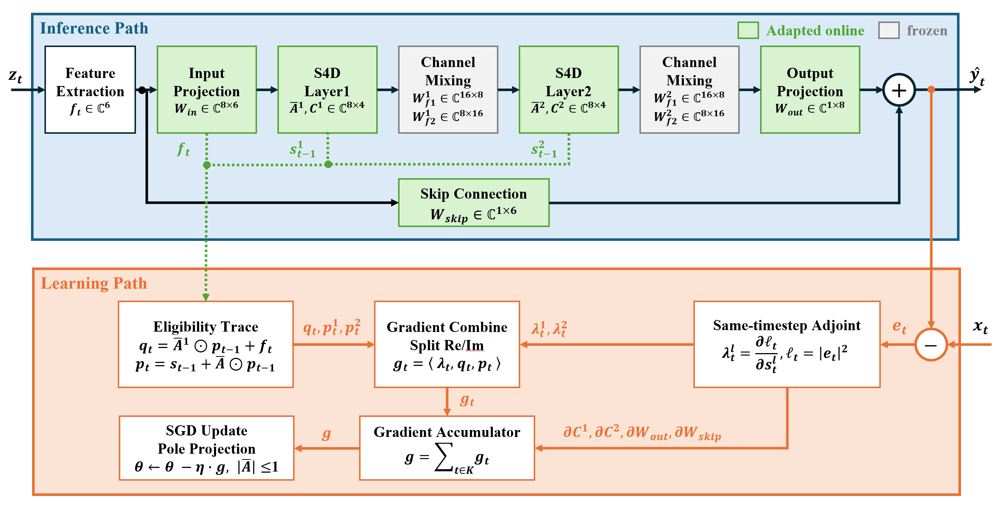
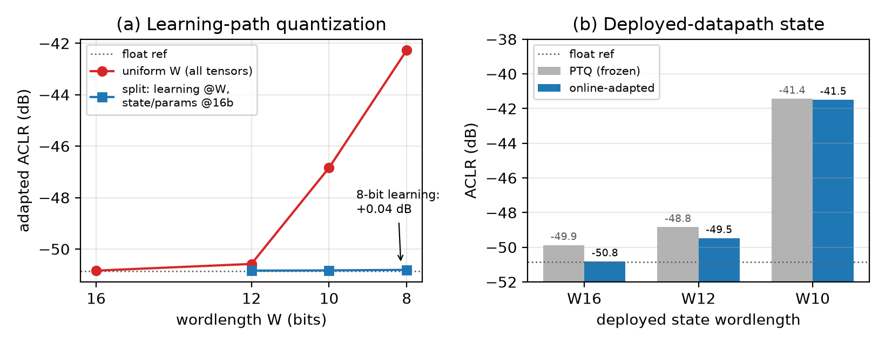

# S4D-RTRL

**Streaming online adaptation for neural digital predistortion (DPD): a diagonal
structured state-space (S4D) predistorter with an *exact* `O(N)`, 8-bit
real-time recurrent learning (RTRL) path.**

Neural-network DPD matches polynomial DPD in linearization accuracy, but power
amplifiers drift with temperature, bias, and aging, and the leading gated-RNN
DPDs cannot compute exact gradients online — their dense recurrent Jacobians
force buffered, multi-epoch backpropagation through time. This repository shows
that a **diagonal S4D** DPD closes that gap: its diagonal recurrence admits
exact real-time recurrent learning at `O(N)` per sample, streaming, with no
sample buffer and no matrix operations, and the whole learning path runs in
8-bit fixed point at parity with float.



*__Inference path__ (top): the S4D DPD — feature extraction, input projection,
two complex diagonal S4D layers with frozen channel-mixing heads, output
projection, and a learned feature skip. __Learning path__ (bottom, this work):
the error `eₜ` drives a same-timestep adjoint producing the state-error signals
`λ`; eligibility traces `q, p` are combined into the per-sample gradient `gₜ`,
accumulated over `K` samples, and applied by SGD with pole projection — the
entire loop is exact and costs `O(N)` per sample.*

> Paper in preparation. This repository releases the **code and the minimal data
> and checkpoints** needed to reproduce the software results. It builds on
> [OpenDPD](https://github.com/lab-emi/OpenDPD) (Apache-2.0); see
> [Attribution](#attribution).

---

## Repository layout

```
S4D-RTRL/
├── rtrl_rflo_full.py        # exact forward-mode RFLO/RTRL on the full S4D DPD
│                            #   (Gate A: port parity, B: RFLO vs BPTT gradients,
│                            #    C: online ILA adaptation RFLO vs BPTT)
├── online_adaptation.py         # online adaptation reaches the offline s4d_best
├── online_ila.py            # indirect-learning (post-inverse) online loop
├── ila_frontend.py          # loop alignment: integer/fractional delay + gain
├── drift_tracking.py          # drift tracking: frozen vs periodic vs streaming
├── fixedpoint_sweep.py     # fixed-point wordlength sweep (8-bit learning path)
├── fixedpoint_drift.py          # hardware-scoped drift tracking, 8-bit ≡ float
├── gmp_baseline.py          # RLS-GMP polynomial baseline / class ceiling
├── figures/                 # fig_architecture.png (diagram) + fig_wordlength.py (plot)
└── opendpd/                 # vendored OpenDPD subset (see Attribution)
    ├── models.py            #   CoreModel + S4D backbone registration
    ├── backbones/           #   s4d.py (this work), dgru.py (PA surrogate), ...
    ├── modules/             #   data_collector.py
    ├── utils/               #   metrics.py (NMSE / EVM / ACLR)
    ├── datasets/APA_200MHz/ #   measured 3.5 GHz GaN Doherty PA dataset
    └── save/APA_200MHz/     #   pretrained PA-surrogate + offline DPD checkpoints
```

## Install

Requires Python ≥ 3.11. The `opendpd/` subset is exposed as importable modules
via an editable install.

Using [uv](https://github.com/astral-sh/uv) (recommended — matches the CUDA
wheel used to train the checkpoints):

```bash
uv sync
uv run rtrl_rflo_full.py
```

Or with pip:

```bash
python -m venv .venv && source .venv/bin/activate   # Windows: .venv\Scripts\activate
pip install -e .
python rtrl_rflo_full.py
```

CPU-only machine: delete the two `[tool.uv.*]` blocks in `pyproject.toml`
(torch then falls back to the CPU wheel). The reproduction scripts run on CPU.

## Reproduce

Run from the repository root. Each script prints its results and PASS/FAIL
gates; figure scripts write PNGs to `figures/`.

| Command | What it produces |
| --- | --- |
| `python rtrl_rflo_full.py` | Core result. Gate A (float64 port parity), Gate B (forward-mode RFLO vs full BPTT gradients, cosine), Gate C (online ILA adaptation: RFLO-updates vs BPTT-updates agree). Prints `PASS`. |
| `python online_adaptation.py` | Online adaptation converges to the offline `s4d_best` baseline (ACLR / EVM / NMSE). |
| `python online_ila.py` | Post-inverse (ILA) online loop — no gradient crosses the PA. |
| `python drift_tracking.py` | Drift tracking over time-varying PA: frozen collapses, periodic retraining shows sawtooth, streaming tracks continuously → `drift_tracking.png`. |
| `python fixedpoint_sweep.py` | Fixed-point wordlength sweep: learning tensors at 8-bit + state/params at 16-bit ≈ float. |
| `python fixedpoint_drift.py` | Hardware-scoped drift tracking with the 8-bit learning path → `fixedpoint_drift.png`. |
| `python gmp_baseline.py` | RLS-GMP polynomial baseline (adaptation cost + class ceiling on measured data). |
| `python figures/fig_wordlength.py` | Wordlength-sweep figure → `figures/fig_wordlength.png`. |

Data and checkpoints ship with the repo (`opendpd/datasets/APA_200MHz/`,
`opendpd/save/APA_200MHz/`), so the online-learning experiments run without
retraining.



*Fixed-point learning path (`fixedpoint_sweep.py`). __(a)__ Keeping state and
parameters at 16-bit while quantizing only the learning tensors (traces,
adjoints, gradients) lets the learning path run at 8-bit within +0.04 dB of
float; uniform quantization of all tensors collapses below 12 bits. __(b)__
Deployed-state quantization — online adaptation partly recovers W12; W10 is
unusable.*

## Attribution

This project builds on **[OpenDPD](https://github.com/lab-emi/OpenDPD)**
(Copyright 2024 Yizhuo Wu, Chang Gao; Apache-2.0). The `opendpd/` directory
contains a minimal vendored subset of OpenDPD needed to run the experiments;
those files retain their original headers, and modifications are noted in-file
and in [`NOTICE`](NOTICE). The S4D backbone (`opendpd/backbones/s4d.py`) and the
experiment scripts (`rtrl_rflo_full`, `online_*`, `drift_tracking`,
`fixedpoint_*`, `gmp_baseline`, `figures/*`) are original work.

## Citation

If you use this code, please cite via [`CITATION.cff`](CITATION.cff) (a paper
reference will be added once available).

## License

[Apache-2.0](LICENSE). Copyright 2026 Kai-Chun Fan. Portions © 2024 Yizhuo Wu,
Chang Gao (OpenDPD), also Apache-2.0.
